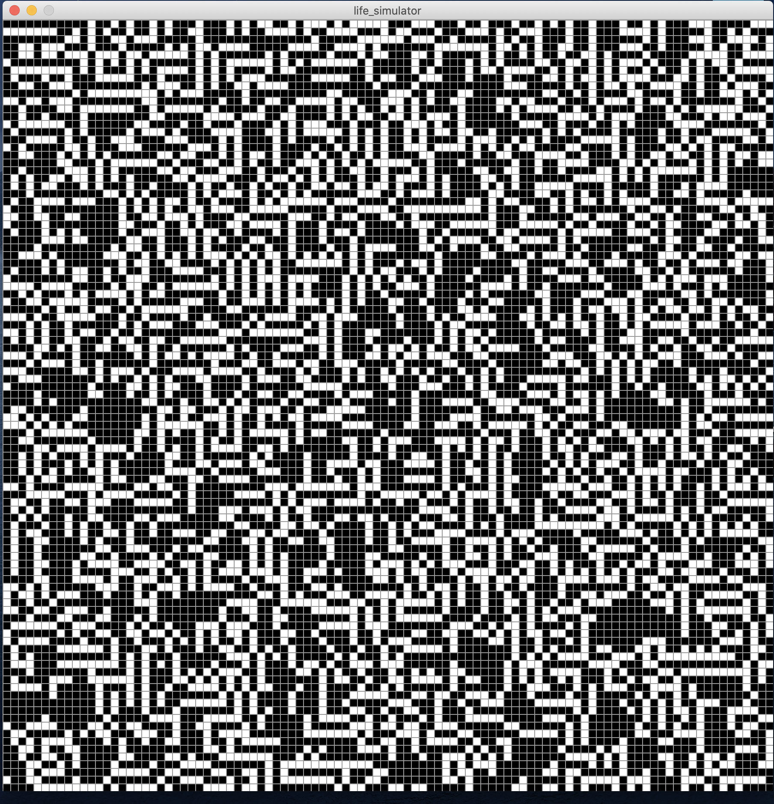
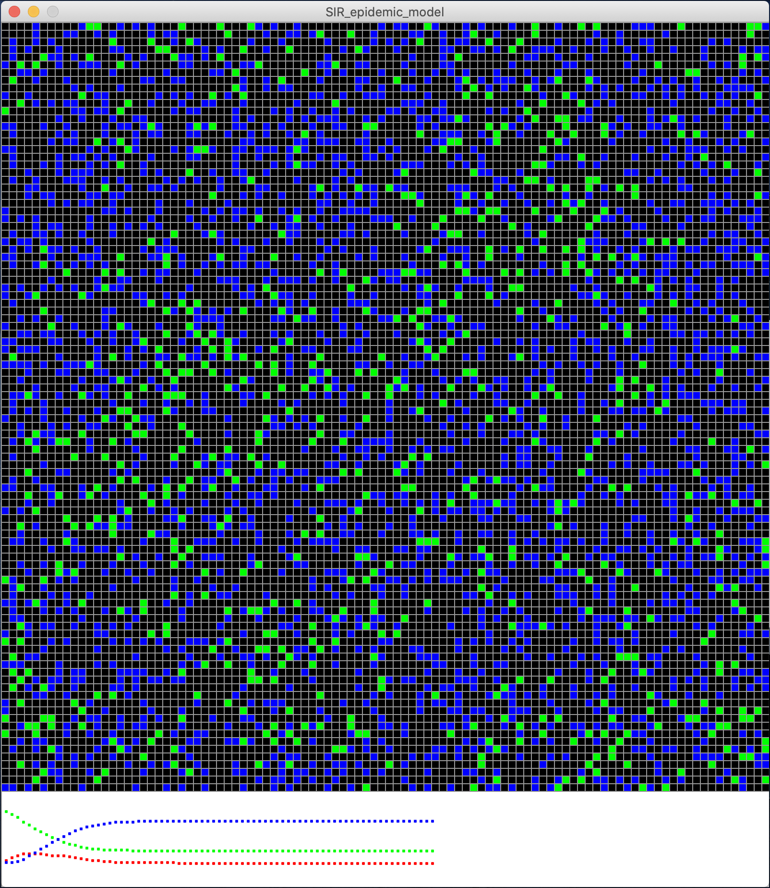
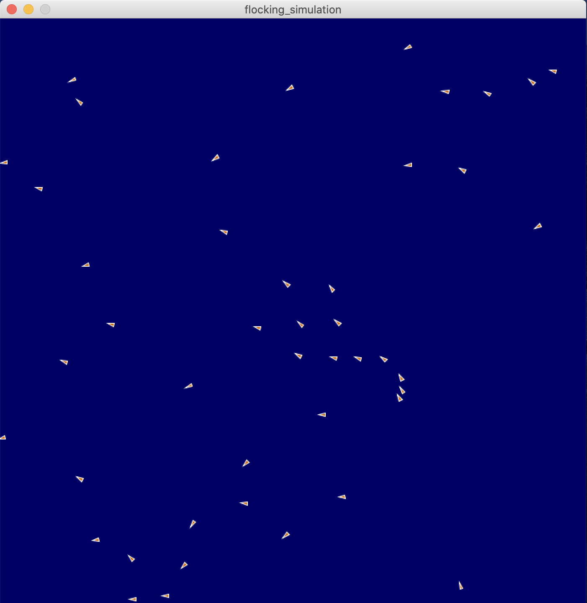
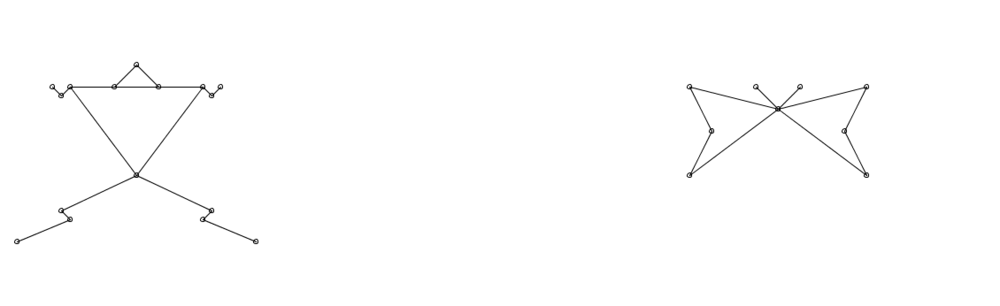

# Introduction 
This repository contains the my implementation of projects for CS 7492 Simulation of Biology taken in Spring 2021. 

# Game of Life Simulation
A cellular automata simulator for the game of Life, originally created by John Horton Conway, is written. For detail, please check out the relevant folder.
<!--  -->

    

# SIR Epidemic Simulation
A SIR simulator and a track of the sub-population counts are required for this project. For detail, please check out the relevant folder.

    

# Flocking Simulation
A flocking simulator, accoridng to Craig Reynolds' three rules of interaction, is written for this project. For detail, please check out the relevant folder.

    

# Reaction-Diffusion Simulation
For this project, a partial differential equations (PDE) simulator using finite differencing on a 2D grid. Specifically, the system known as Gray-Scott reaction-diffusion system will be simulated. The equation that govern this system are:

    

# Locomotion Simulation
The purpose of this project is to create virtual creatures and make them move. For detail, please check out the relevant folder.

    

